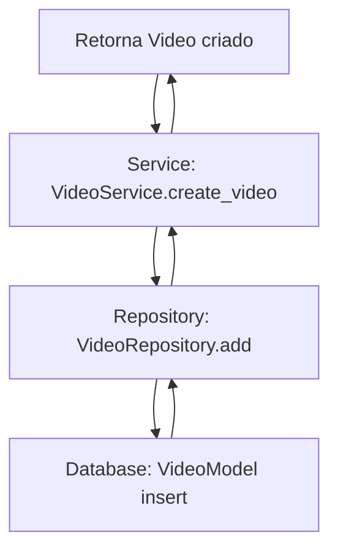

# ViralizAI 🚀

[](https://www.python.org/)  
[](LICENSE)  
[](https://github.com/seu-usuario/viralizai/actions)  
[](https://github.com/seu-usuario/viralizai/actions)  

**ViralizAI** é uma plataforma em Python para **criação automatizada de vídeos curtos (TikTok / YouTube Shorts)** usando IA. O sistema gera vídeos, dublagens e legendas automaticamente, podendo processar conteúdos via links ou prompts de texto.

---

## 🌟 Funcionalidades

- Criação de vídeos a partir de **prompts ou links de vídeos**.  
- **Dublagem automática** (via ElevenLabs API).  
- **Geração automática de legendas**.  
- Integração com **n8n** para workflows automatizados.  
- Arquitetura **hexagonal**, modular e testável.  

---

## 🏗 Arquitetura Hexagonal

```text
   ┌─────────────────────────────┐
   │        Interfaces           │
   │  (API REST / CLI / n8n)    │
   └─────────────┬──────────────┘
                 │
                 ▼
   ┌─────────────────────────────┐
   │       Application           │
   │ (Use Cases / App Services)  │
   └─────────────┬──────────────┘
                 │
        ┌────────┴────────┐
        │                 │
  ┌───────────────┐  ┌───────────────┐
  │     Domain    │  │ Infrastructure │
  │ (Entities +   │  │ (APIs externas,│
  │ Domain Services) │ banco, storage) │
  └───────────────┘  └───────────────┘
```

💡 **Legenda do fluxo**:  
1. O usuário faz uma requisição (Interface).  
2. A **Application** orquestra os casos de uso, validando regras do domínio.  
3. Os **Domain Services** aplicam regras de negócio puras.  
4. A **Infrastructure** executa tarefas externas (API de vídeo, dublagem, armazenamento).  
5. Resultado sobe novamente até a Interface para o usuário.  

---

## 🛠 Tecnologias

- Python 3.11+  
- FastAPI  
- SQLAlchemy  
- Requests / HTTPX  
- ElevenLabs API  
- n8n  
- pytest  

---

## 🚀 Estrutura de Pastas

```
ViralizAI/
├── app/
│   ├── main.py
│   └── services/
│       ├── service_registration_block.py
│       └── videos/
│           └── video_service.py
├── domain/
│   └── entities/
│       └── videos/
│           └── video.py
├── infrastructure/
│   ├── models/videos/video_model.py
│   ├── mappers/videos/video_mapper.py
│   └── repositories/
│       ├── comuns/base_repository.py
│       └── videos/video_repository.py
└── interfaces/api/
    ├── video_controller.py
    └── router_registration_block.py
```

---

## 📌 Tutorial: Criando uma Nova Entidade

Este tutorial mostra como criar uma nova entidade seguindo a arquitetura hexagonal do ViralizAI. Usaremos **Usuario** como exemplo.

### 1️⃣ **Criar a Entidade de Domínio**

Crie o arquivo `domain/entities/usuarios/usuario.py`:

```python
from dataclasses import dataclass
from enum import Enum
from typing import Optional
import uuid

class StatusUsuario(Enum):
    ATIVO = "Ativo"
    INATIVO = "Inativo"
    BLOQUEADO = "Bloqueado"

@dataclass
class Usuario:
    id: str
    nome: str
    email: str
    telefone: Optional[str] = None
    status: StatusUsuario = StatusUsuario.ATIVO
    data_criacao: Optional[str] = None

    @staticmethod
    def create_new(nome: str, email: str) -> "Usuario":
        return Usuario(
            id=str(uuid.uuid4()),
            nome=nome,
            email=email
        )
```

### 2️⃣ **Criar o Mapeamento de Banco**

Crie o arquivo `infrastructure/models/usuarios/usuario_db_mapping.py`:

```python
from sqlalchemy import Column, String, Enum, DateTime
from infrastructure.database import Base
from domain.entities.usuarios.usuario import StatusUsuario

class UsuarioDbMapping(Base):
    __tablename__ = "usuarios"

    id = Column(String(36), primary_key=True, index=True)
    nome = Column(String, nullable=False)
    email = Column(String, nullable=False, unique=True)
    telefone = Column(String, nullable=True)
    status = Column(Enum(StatusUsuario), default=StatusUsuario.ATIVO)
    data_criacao = Column(DateTime, nullable=True)
```

### 3️⃣ **Criar o Mapper**

Crie o arquivo `infrastructure/mappers/usuarios/usuario_mapper.py`:

```python
from domain.entities.usuarios.usuario import StatusUsuario, Usuario
from infrastructure.models.usuarios.usuario_db_mapping import UsuarioDbMapping

class UsuarioMapper:
    @staticmethod
    def to_model(entity: Usuario) -> UsuarioDbMapping:
        return UsuarioDbMapping(
            id=entity.id,
            nome=entity.nome,
            email=entity.email,
            telefone=entity.telefone,
            status=entity.status,
            data_criacao=entity.data_criacao
        )

    @staticmethod
    def to_entity(model: UsuarioDbMapping) -> Usuario:
        return Usuario(
            id=model.id,
            nome=model.nome,
            email=model.email,
            telefone=model.telefone,
            status=StatusUsuario(model.status.value),
            data_criacao=model.data_criacao
        )
```

### 4️⃣ **Criar o Repository Port (Contrato)**

Crie o arquivo `domain/repositories/usuario_repository_port.py`:

```python
from typing import Protocol, Optional, List
from domain.entities.usuarios.usuario import Usuario

class UsuarioRepositoryPort(Protocol):
    """Contrato para repositório de usuários"""
    
    def add(self, entity: Usuario) -> Usuario: ...
    def get_all(self) -> List[Usuario]: ...
    def get_by_id(self, id_entity: str) -> Optional[Usuario]: ...
    def update(self, entity: Usuario) -> Usuario: ...
    def delete(self, entity: Usuario) -> None: ...
    def delete_by_id(self, id_entity: str) -> None: ...
```

### 5️⃣ **Criar o Repository (Implementação)**

Crie o arquivo `infrastructure/repositories/usuarios/usuario_repository.py`:

```python
from typing import Optional
from sqlalchemy.orm import Session
from domain.entities.usuarios.usuario import Usuario, StatusUsuario
from domain.repositories.usuario_repository_port import UsuarioRepositoryPort
from infrastructure.mappers.usuarios.usuario_mapper import UsuarioMapper
from infrastructure.models.usuarios.usuario_db_mapping import UsuarioDbMapping
from infrastructure.repositories.comuns.base_repository import BaseRepository

class UsuarioRepository(BaseRepository[Usuario, UsuarioDbMapping], UsuarioRepositoryPort):
    """Implementação do repositório de usuários usando SQLAlchemy"""
    
    def __init__(self, session: Session):
        super().__init__(session, UsuarioDbMapping, UsuarioMapper)
    
    def update_status(self, usuario_id: str, status: StatusUsuario) -> Optional[Usuario]:
        """Atualiza status de um usuário específico"""
        usuario = self.get_by_id(usuario_id)
        if usuario:
            usuario.status = status
            return self.update(usuario)
        return None
```

### 6️⃣ **Criar o App Service**

Crie o arquivo `app/services/usuarios/usuario_service.py`:

```python
from typing import Optional
from domain.entities.usuarios.usuario import Usuario, StatusUsuario
from domain.repositories.usuario_repository_port import UsuarioRepositoryPort
from app.services.base_app_service import BaseAppService

class UsuarioService(BaseAppService[Usuario]):
    """Serviço de usuários - casos de uso específicos do domínio"""
    
    def __init__(self, repository: UsuarioRepositoryPort):
        super().__init__(repository)

    def create_usuario(self, nome: str, email: str) -> Usuario:
        """Cria um novo usuário"""
        usuario = Usuario.create_new(nome, email)
        return self.add(usuario)

    def block_usuario(self, usuario_id: str) -> Optional[Usuario]:
        """Bloqueia um usuário"""
        return self._repository.update_status(usuario_id, StatusUsuario.BLOQUEADO)

    def activate_usuario(self, usuario_id: str) -> Optional[Usuario]:
        """Ativa um usuário"""
        return self._repository.update_status(usuario_id, StatusUsuario.ATIVO)
```

### 7️⃣ **Criar os Schemas Pydantic**

Crie o arquivo `interfaces/api/schemas/usuario_schemas.py`:

```python
from typing import Optional
from pydantic import BaseModel
from domain.entities.usuarios.usuario import StatusUsuario

class UsuarioCreateRequest(BaseModel):
    """Schema para criação de usuário"""
    nome: str
    email: str
    telefone: Optional[str] = None

class UsuarioUpdateRequest(BaseModel):
    """Schema para atualização de usuário"""
    nome: Optional[str] = None
    email: Optional[str] = None
    telefone: Optional[str] = None
    status: Optional[StatusUsuario] = None

class UsuarioResponse(BaseModel):
    """Schema para resposta de usuário"""
    id: str
    nome: str
    email: str
    telefone: Optional[str] = None
    status: StatusUsuario
    data_criacao: Optional[str] = None

    class Config:
        from_attributes = True
```

### 8️⃣ **Criar o Controller**

Crie o arquivo `interfaces/api/usuario_controller.py`:

```python
from fastapi import APIRouter, Depends, Request, HTTPException, status
from typing import List
from app.services.service_registration_block import ServiceRegistrationBlock
from app.services.usuarios.usuario_service import UsuarioService
from interfaces.api.schemas.usuario_schemas import UsuarioCreateRequest, UsuarioUpdateRequest, UsuarioResponse
from domain.entities.usuarios.usuario import Usuario

router = APIRouter()

def get_services(request: Request) -> ServiceRegistrationBlock:
    return request.app.state.services

def get_usuario_service(services: ServiceRegistrationBlock = Depends(get_services)) -> UsuarioService:
    return services.usuario_service

@router.post("", response_model=UsuarioResponse)
def create_usuario(
    usuario_data: UsuarioCreateRequest,
    usuario_service: UsuarioService = Depends(get_usuario_service)
):
    """Cria um novo usuário"""
    return usuario_service.create_usuario(usuario_data.nome, usuario_data.email)

@router.get("", response_model=List[UsuarioResponse])
def get_all_usuarios(usuario_service: UsuarioService = Depends(get_usuario_service)):
    """Lista todos os usuários"""
    return usuario_service.get_all()

@router.get("/{usuario_id}", response_model=UsuarioResponse)
def get_usuario_by_id(
    usuario_id: str,
    usuario_service: UsuarioService = Depends(get_usuario_service)
):
    """Busca usuário por ID"""
    usuario = usuario_service.get_by_id(usuario_id)
    if not usuario:
        raise HTTPException(
            status_code=status.HTTP_404_NOT_FOUND,
            detail="Usuário não encontrado"
        )
    return usuario

# Rotas específicas do domínio
@router.patch("/{usuario_id}/block", response_model=UsuarioResponse)
def block_usuario(
    usuario_id: str,
    usuario_service: UsuarioService = Depends(get_usuario_service)
):
    """Bloqueia um usuário"""
    usuario = usuario_service.block_usuario(usuario_id)
    if not usuario:
        raise HTTPException(
            status_code=status.HTTP_404_NOT_FOUND,
            detail="Usuário não encontrado"
        )
    return usuario

@router.patch("/{usuario_id}/activate", response_model=UsuarioResponse)
def activate_usuario(
    usuario_id: str,
    usuario_service: UsuarioService = Depends(get_usuario_service)
):
    """Ativa um usuário"""
    usuario = usuario_service.activate_usuario(usuario_id)
    if not usuario:
        raise HTTPException(
            status_code=status.HTTP_404_NOT_FOUND,
            detail="Usuário não encontrado"
        )
    return usuario
```

### 9️⃣ **Registrar nos Blocks**

**RepositoryRegistrationBlock** (`infrastructure/repositories/repository_registration_block.py`):
```python
from infrastructure.repositories.videos.video_repository import VideoRepository
from infrastructure.repositories.usuarios.usuario_repository import UsuarioRepository

class RepositoryRegistrationBlock:
    def __init__(self, session):
        self.videos = VideoRepository(session)
        self.usuarios = UsuarioRepository(session)
```

**ServiceRegistrationBlock** (`app/services/service_registration_block.py`):
```python
from app.services.videos.video_service import VideoService
from app.services.usuarios.usuario_service import UsuarioService
from infrastructure.repositories.repository_registration_block import RepositoryRegistrationBlock

class ServiceRegistrationBlock:
    def __init__(self, repositories: RepositoryRegistrationBlock):
        self.video_service = VideoService(repositories.videos)
        self.usuario_service = UsuarioService(repositories.usuarios)
```

**RouterRegistrationBlock** (`interfaces/api/router_registration_block.py`):
```python
from fastapi import FastAPI
from interfaces.api import video_controller, usuario_controller

class RouterRegistrationBlock:
    def __init__(self):
        self.routers = [
            (video_controller.router, "/videos", ["Vídeos"]),
            (usuario_controller.router, "/usuarios", ["Usuários"]),
        ]

    def register_all(self, app: FastAPI):
        for router, prefix, tags in self.routers:
            app.include_router(router, prefix=prefix, tags=tags)
```

### ✅ **Resultado Final**

Após seguir este tutorial, você terá:

- **Entidade**: `Usuario` com regras de domínio
- **Mapeamento**: `UsuarioDbMapping` para persistência
- **Repository**: `UsuarioRepository` com CRUD completo
- **Service**: `UsuarioService` com casos de uso
- **Controller**: Endpoints REST completos
- **Schemas**: Validação de entrada/saída

**Endpoints disponíveis:**
- `POST /usuarios` - Criar usuário
- `GET /usuarios` - Listar todos
- `GET /usuarios/{id}` - Buscar por ID
- `PATCH /usuarios/{id}/block` - Bloquear usuário
- `PATCH /usuarios/{id}/activate` - Ativar usuário

---


---

## 📌 Fluxo de criação de vídeo (Mermaid)



---

## 🚀 Como Começar

1. Clone o repositório:  
```bash
git clone <repo-url>
cd ViralizAI
```

2. Instale as dependências:  
```bash
pip install -r requirements.txt
```

3. Rode a aplicação mínima:  
```bash
python -m uvicorn app.main:app --reload
```

---

## 🤝 Contribuição

1. Fork o repositório  
2. Crie sua branch: `git checkout -b feature/nova-funcionalidade`  
3. Commit suas alterações: `git commit -m "Adiciona nova funcionalidade"`  
4. Push para a branch: `git push origin feature/nova-funcionalidade`  
5. Abra um Pull Request

