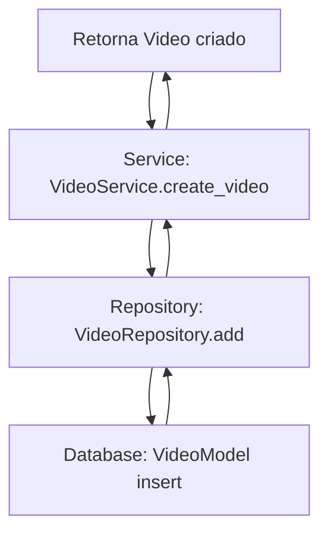

# ViralizAI 🚀

[](https://www.python.org/)  
[](LICENSE)  
[](https://github.com/seu-usuario/viralizai/actions)  
[](https://github.com/seu-usuario/viralizai/actions)  

**ViralizAI** é uma plataforma em Python para **criação automatizada de vídeos curtos (TikTok / YouTube Shorts)** usando IA. O sistema gera vídeos, dublagens e legendas automaticamente, podendo processar conteúdos via links ou prompts de texto.

---

## 🌟 Funcionalidades

- Criação de vídeos a partir de **prompts ou links de vídeos**.  
- **Dublagem automática** (via ElevenLabs API).  
- **Geração automática de legendas**.  
- Integração com **n8n** para workflows automatizados.  
- Arquitetura **hexagonal**, modular e testável.  

---

## 🏗 Arquitetura Hexagonal

```text
   ┌─────────────────────────────┐
   │        Interfaces           │
   │  (API REST / CLI / n8n)    │
   └─────────────┬──────────────┘
                 │
                 ▼
   ┌─────────────────────────────┐
   │       Application           │
   │ (Use Cases / App Services)  │
   └─────────────┬──────────────┘
                 │
        ┌────────┴────────┐
        │                 │
  ┌───────────────┐  ┌───────────────┐
  │     Domain    │  │ Infrastructure │
  │ (Entities +   │  │ (APIs externas,│
  │ Domain Services) │ banco, storage) │
  └───────────────┘  └───────────────┘
```

💡 **Legenda do fluxo**:  
1. O usuário faz uma requisição (Interface).  
2. A **Application** orquestra os casos de uso, validando regras do domínio.  
3. Os **Domain Services** aplicam regras de negócio puras.  
4. A **Infrastructure** executa tarefas externas (API de vídeo, dublagem, armazenamento).  
5. Resultado sobe novamente até a Interface para o usuário.  

---

## 🛠 Tecnologias

- Python 3.11+  
- FastAPI  
- SQLAlchemy  
- Requests / HTTPX  
- ElevenLabs API  
- n8n  
- pytest  

---

## 🚀 Estrutura de Pastas

```
ViralizAI/
├── app/
│   ├── main.py
│   └── services/
│       ├── service_registration_block.py
│       └── videos/
│           └── video_service.py
├── domain/
│   └── entities/
│       └── videos/
│           └── video.py
├── infrastructure/
│   ├── models/videos/video_model.py
│   ├── mappers/videos/video_mapper.py
│   └── repositories/
│       ├── comuns/base_repository.py
│       └── videos/video_repository.py
└── interfaces/api/
    ├── video_controller.py
    └── router_registration_block.py
```

---

## 📌 Exemplo de Entidade: `Video`

```python
from dataclasses import dataclass
from enum import Enum
from typing import Optional
import uuid

class StatusDoVideo(Enum):
    PENDENTE = "Pendente"
    PROCESSING = "Processando"
    READY = "Pronto"
    FAILED = "Falhou"

@dataclass
class Video:
    id: str
    title: str
    source_url: str
    local_path: Optional[str] = None
    status: StatusDoVideo = StatusDoVideo.PENDENTE
    duration: Optional[float] = None
    language: str = "pt"

    @staticmethod
    def create_new(title: str, source_url: str) -> "Video":
        return Video(
            id=str(uuid.uuid4()),
            title=title,
            source_url=source_url
        )
```

---

## 📌 Exemplo de Model e Mapper

```python
# infrastructure/models/videos/video_model.py
from sqlalchemy import Column, String, Enum, Float
from infrastructure.database import Base
from domain.entities.videos.video import StatusDoVideo

class VideoModel(Base):
    __tablename__ = "videos"

    id = Column(String(36), primary_key=True, index=True)
    title = Column(String, nullable=False)
    source_url = Column(String, nullable=False)
    local_path = Column(String, nullable=True)
    status = Column(Enum(StatusDoVideo), default=StatusDoVideo.PENDENTE)
    duration = Column(Float, nullable=True)
    language = Column(String, default="pt-BR")
```

```python
# infrastructure/mappers/videos/video_mapper.py
from domain.entities.videos.video import StatusDoVideo, Video
from infrastructure.models.videos.video_model import VideoModel

class VideoMapper:
    @staticmethod
    def to_model(entity: Video) -> VideoModel:
        return VideoModel(
            id=entity.id,
            title=entity.title,
            source_url=entity.source_url,
            local_path=entity.local_path,
            status=StatusDoVideo(entity.status),
            duration=entity.duration,
            language=entity.language
        )

    @staticmethod
    def to_entity(model: VideoModel) -> Video:
        return Video(
            id=model.id,
            title=model.title,
            source_url=model.source_url,
            local_path=model.local_path,
            status=StatusDoVideo(model.status.value),
            duration=model.duration,
            language=model.language
        )
```

---

## 📌 Exemplo de Repository

```python
# infrastructure/repositories/comuns/base_repository.py
class BaseRepository:
    def __init__(self, session, model, mapper):
        self.session = session
        self.model = model
        self.mapper = mapper

    def add(self, entity):
        model_instance = self.mapper.to_model(entity)
        self.session.add(model_instance)
        self.session.commit()
        return self.mapper.to_entity(model_instance)

    def get_all(self):
        results = self.session.query(self.model).all()
        return [self.mapper.to_entity(item) for item in results]

    def get_by_id(self, id_entity):
        model_instance = self.session.query(self.model).filter_by(id=id_entity).first()
        return self.mapper.to_entity(model_instance) if model_instance else None

    def delete(self, entity):
        model_instance = self.mapper.to_model(entity)
        self.session.delete(model_instance)
        self.session.commit()
```

---

## 📌 Fluxo de criação de vídeo (Mermaid)



---

## 🚀 Como Começar

1. Clone o repositório:  
```bash
git clone <repo-url>
cd ViralizAI
```

2. Crie e ative o ambiente virtual:  
```bash
python -m venv venv
source venv/bin/activate  # Linux/Mac
venv\Scripts\activate     # Windows
```

3. Instale as dependências:  
```bash
pip install -r requirements.txt
```

4. Rode a aplicação mínima:  
```bash
python app/main.py
```

---

## 🤝 Contribuição

1. Fork o repositório  
2. Crie sua branch: `git checkout -b feature/nova-funcionalidade`  
3. Commit suas alterações: `git commit -m "Adiciona nova funcionalidade"`  
4. Push para a branch: `git push origin feature/nova-funcionalidade`  
5. Abra um Pull Request

